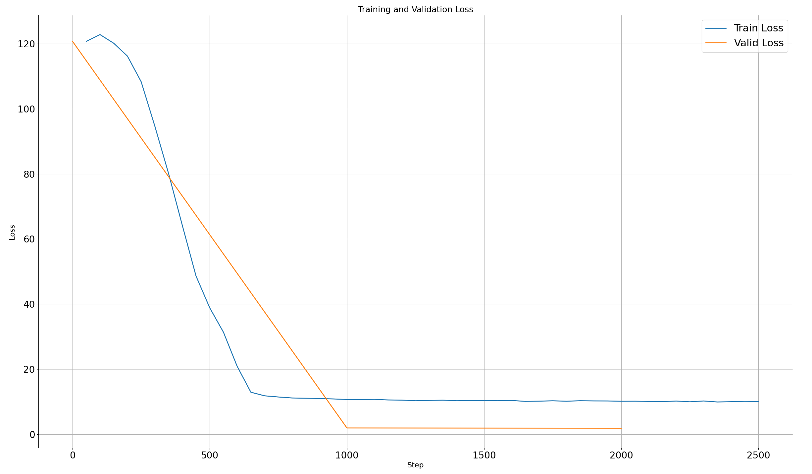

# News Summarization with T5-large (LoRA)

## Project overview

This project fine-tunes a sequence-to-sequence model for news summarization in Russian.
The core idea is to handle very long news articles that exceed the context length of T5 by first
compressing them into a shorter, information-dense representation using sentence embeddings,
and only then feeding this compressed input to the summarization model.

The base summarization model is **T5 / mT5-large**, fine-tuned using **LoRA (PEFT)** to reduce
memory usage and training cost while preserving model quality.

---

## Algorithm: sentence-based input compression

Since full news articles are often too long for the model, the following compression pipeline
is applied before training and inference:

1. **Sentence splitting**  
   The article is split into sentences using `nltk.sent_tokenize`.

2. **Chunking**  
   Sentences are grouped into fixed-size chunks (`sent_in_chunk`), depending on the total
   length of the article (small / medium / large).

3. **Chunk-level representation**  
   For each chunk, all its sentences are concatenated and embedded using
   `ai-forever/sbert_large_mt_nlu_ru` (Sentence-BERT).

4. **Sentence scoring**  
   Each sentence inside the chunk is embedded individually.  
   Cosine similarity between the sentence embedding and the chunk embedding is computed,
   producing a relevance score.

5. **Sentence selection**  
   From each chunk:
   - `best_sbert` most relevant sentences are selected,
   - `worst_sbert` least relevant sentences are kept to preserve context diversity,
   - `random` sentences are sampled from the remaining middle set.

   Selected sentences are sorted by their original order and concatenated.

6. **Prompt construction**  

This reduces the original article length by ~2–3× while keeping the most informative content.

---

## Training setup

- **Base model**: `google/mt5-large`
- **Fine-tuning method**: LoRA (PEFT)
- **Sentence embeddings**: `ai-forever/sbert_large_mt_nlu_ru`
- **Trainer**: `Seq2SeqTrainer` from Hugging Face Transformers

Typical training configuration:
- `per_device_train_batch_size = 2`
- `gradient_accumulation_steps = 4`
- `learning_rate ≈ 1e-4` (LoRA parameters only)
- `fp16 = True` (mixed precision)
- `max_grad_norm = 1.0`
- Non-zero warmup to stabilize fp16 training

Only LoRA adapter parameters are trained; the base T5 weights remain frozen.

The training lasted about 1.5 hours on GPU V100

---

## Training dynamics

Training and validation loss were logged using TensorBoard.

- Initial loss: ~120
- After ~600–700 training steps:
- **Train loss ≈ 10**
- **Validation loss ≈ 2**

The gap between train and validation loss is expected and likely caused by dropout
and evaluation settings. The loss curves show fast convergence and stable behavior
after the initial phase.

---

## Qualitative results

Below are examples comparing the **fine-tuned model** with the **default base model**
(without LoRA fine-tuning).

### Example 1

**Fine-tuned model**

В ОАЭ высокопоставленная американская и израильская делегация находятся в ОАЭ с двухдневным визитом, за время которого стороны заключили историческое соглашение о нормализации отношений между США, Израилем и ОАЭ.

**Default mT5-large**

<extra_id_0> и Израилем. Краткое содержание: <extra_id_1> и Израиля. <extra_id_2> и Израиля. ...

---

### Example 2

**Fine-tuned model**

Вице-премьер и экс-посол Украины в Белоруссии Роман Бессмертный предсказал новый «майдан» и потерю власти действующему президенту Украины Владимиру Зеленскому. Он заявил, что Украина близится к тому, чтобы стать парламентской республикой, а Зеленский может оказаться последним президентом страны.

**Default mT5-large**

<extra_id_0> президента Украины Владимира Зеленского.  <extra_id_1> президента Украины Владимира Зеленского.  <extra_id_2> президента Украины.  <extra_id_3> президента Украины.  <extra_id_4> президента Украины.  <extra_id_5> президента Украины.  <extra_id_6> президента Украины.  <extra_id_7> президента Украины.  <extra_id_8> президента Украины.  <extra_id_9> президента Украины.  <extra_id_10> президента Украины.  <extra_id_11> президента.  <extra_id_55> президента. .  <extra_id_56> президент

---

### Example 3

**Fine-tuned model**

В России вступают в силу поправки в закон «О банкротстве» — теперь должники смогут освобождаться от непосильных обязательств во внесудебном порядке, если сумма задолженности составляет не менее 50 тыс. рублей.

**Default mT5-large**

<extra_id_0> краткое содержание: ... <extra_id_1> краткое содержание: ... Краткое содержание: ... Краткое содержание: ... Краткое содержание: ... <extra_id_2> краткое содержание: ... <extra_id_3> краткое содержание: ... <extra_id_4> краткое содержание: ... <extra_id_5> краткое содержание: ... <extra_id_6>: ... <extra_id_7>: ... <extra_id_8>: ... <extra_id_21>: ... <extra_id_22>: ... <extra_id_23>: ... <extra_id_24>: ... <extra_id_25>. <extra_id_26>.  <extra_id_27>.  <extra_id_28>.  <extra_id_29>.  <extra_id_30>.  <extra_id_31>.  <extra_id_32>.  <extra_id_33>.  <extra_id_34>.  <extra_id_35>.  <extra_id_36>.  <extra_id_37>. 

---
